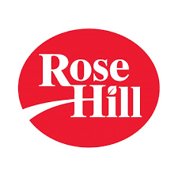

# Inventory Management System

# Project Overview :chart_with_upwards_trend:
- The project being presented is a Inventory Management System desktop application. The goal is to improve the client's current inventory system. Our client is Rose hill foods inc located in Montreal, it was founded in 1983 by George Serbanis and his team of professionals. Rosehill inc foods manufactures and supplies the food service industry with quality soups, sauces, seasonings, and along with its Original 86 division, offers a wide range of premium grade, high-end products such as stock bases, liquid sauces, marinades and glazes. To make the prototype app we are determined to communicate every weekday and once every sunday. In these meetings each person provides a summary of what they are working on, progress updates and any blockers. We will closely keep track of individual progress and to make sure that no one is behind on the project schedule.

# Client
-
- Rose Hill Foods Inc
- Located at 7171 Thimens Blvd.
Saint-Laurent (Montreal) , QC H4S 2A2

# User Case
- SOON

# ERD diagram
- SOON

# Class Diagram
- SOON

# Features
1. 4 types of users and each one has its own user privilege
2. User Authentication - user has to login with their credentials in order to use the application
3. The ability track and manage inventory in real-time
4. Built in time and date display functionality
5. The ability to create a new item and add it to the database
6. The ability to fetch all items in the database and display it in datagrid view which can be sorted in many ways.
7. The ability to search an item by product code or product name and displays it in datagrid view which can be sorted in many ways.
8. The ability to filter items by code, name, category, size, quantity, etc.
9. The ability to modify item information's
10. The ability to delete existing item
11. The ability to notify the user when a product is at low stock levels
12. The ability to produce report and the option to print
13. The ability to check the user guide in the help menu window
14. The ability to show confirmation messages to the user when performing action that affects the database
15. Input validation and robustness

# Future improvements (Functionality / Design)
1. Add the ability to increment the item quantity if an item is returned
2. Optimization - implementation of multi threading or async
3. Redesign Report UI and add the ability to produce report by monthly or yearly
4. Add the ability to create new user
5. Add pagination when the datagrid contains 100 items
6. Add the ability to maximize application window
7. Make the window responsive

# Team :office:
- Jeffrey Grospe
- Emmy Ea
- Kyle Husbands
- Natan Lellouche

# System Development Professor :school:
- Alex Steinheuser Vilvert

<!-- LINKS -->
